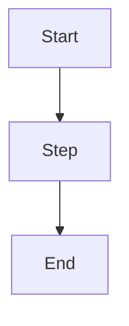

# <Project Name>

# General Information

## Task ID
- PA-XXXX

## Developer
- Enter your name

## Reviewers
- Enter reviewer's names

## Version
- 1.0

## Goal
- Enter goals of this project.

## Requirements
- Enter requirements of this project.

# Technical Design

## Scope & Constraints
### In Scope
- What this design covers, derived from acceptance criteria.
### Out of Scope
- What this design explicitly does not cover.
### Constraints
- Technical, timeline, or organizational constraints.

## General Flow

Figure 1. Flow Chart for Project
The components for which development is necessary are shown as yellow.

## Architecture

### Current State
- How the relevant parts of the system work today. Reference specific modules, services, and files.

### Proposed Changes
- What changes and why. High-level description of the approach.

#### Component Breakdown
- Per affected module/component:
  - Current behavior
  - Proposed behavior
  - API/interface changes (if any)
  - Data model changes (if any)

## Database Services
- Describe database technologies, schemas, and data storage decisions.

## Backend Technologies
- List backend languages, frameworks, and libraries used.

## Outsourced Services
- List any third-party or external services integrated.

## Alternatives Considered
- At least 2 alternatives with pros, cons, and why not chosen.

## Security Considerations
- **Authentication & Authorization**: What auth does this require? New endpoints need middleware coverage matching existing ones.
- **Sensitive Data**: What data is sensitive (PII, partner IDs, credentials)? Where stored, transmitted, how protected?
- **Attack Surface**: What is exposed? Client-side code, redirect URLs, public endpoints, internal APIs.

If this change has no security implications, state why in one sentence and remove the sub-bullets.

## Edge Cases & Failure Modes
| # | Scenario | Impact | Handling |
|---|----------|--------|----------|
| 1 | ... | ... | ... |

## Failure Modes & Recovery

| Dependency | What if unavailable? | Detection | Recovery |
|---|---|---|---|
| ... | ... | ... | ... |

- **Async failure visibility**: How are async job failures detected and surfaced?
- **Retry policy**: Max attempts, backoff strategy, retryable vs non-retryable error distinction.
- **Recovery after outage**: What does the system do when a failed dependency comes back?

If this change has no failure mode implications (e.g., pure UI change with no backend), state why in one sentence and remove the table.

## Capacity & Performance
- **Expected volume**: How many partners? Events/requests per second at peak?
- **Data growth**: How much data per partner per day/month?
- **Resource profile**: Redis memory, DB connections, queue depth at peak.
- **Known limits**: Item size constraints, message size limits, timeout boundaries.

Back-of-napkin math is fine. "~100 req/s at peak across 500 partners" is better than "should handle expected load."

## Benchmark and Cost Estimation
- Provide performance benchmarks and estimated infrastructure costs.

## Testing Strategy
- Unit tests, integration tests, and manual testing scenarios.

## Monitoring and Alarms
- Describe monitoring setup, alerting thresholds, and dashboards.

## Migration & Rollback
- How to deploy safely. Feature flags, phased rollout, rollback procedure.

## Open Questions
- Items that need team discussion or PM input before implementation.

## Appendix
- Additional references, diagrams, or supporting materials.
